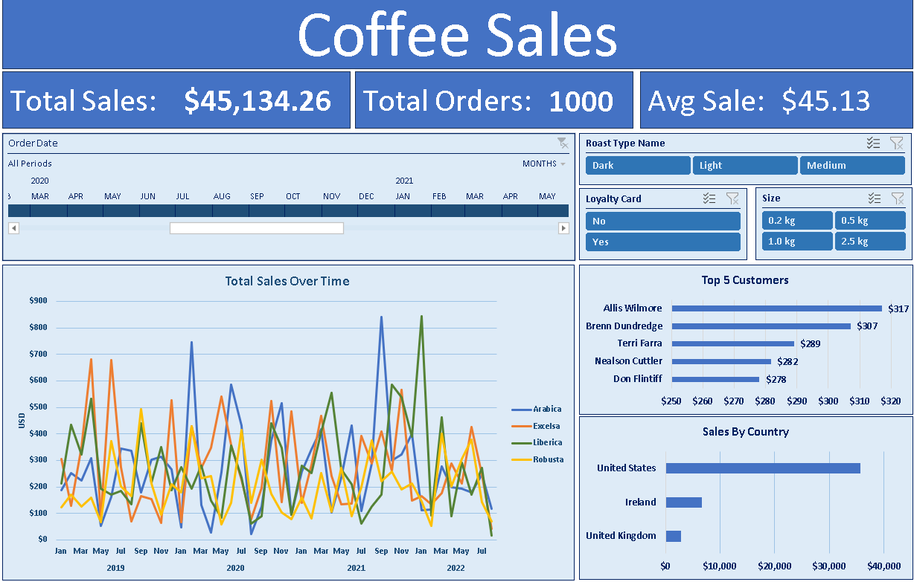

# Coffee Sales Dashboard 📊☕

This Excel-based project analyzes international coffee sales and builds an interactive dashboard with KPIs that respond to slicers and a timeline.

## 📁 Project Overview

This project uses real-world-style coffee sales data to:

- Clean and merge order, customer, and product data
- Create a dynamic pivot table structure
- Build a slicer- and timeline-controlled dashboard
- Calculate and display KPIs including Total Sales, Order Count, and Average Order Value

## 🛠 Tools Used

- Microsoft Excel (PivotTables, Slicers, Timeline, GETPIVOTDATA)
- Data cleaning and transformation in Excel

## 📊 Key Features

- **Dynamic KPIs**: Total Sales, Total Orders, and Average Order Value
- **Slicers**: Filter by Country, Coffee Type, and Roast Type
- **Timeline**: Scroll and filter sales data over time
- **Interactive Dashboard**: Visuals respond to user selections

## 🔍 Key Insights

- United States led in total sales
- Arabica and Robusta were the top-performing coffee types
- Loyalty card members placed high-value orders more consistently

## 📌 What I Learned

- How to structure an Excel dashboard for interactivity and usability
- Advanced PivotTable techniques, including calculated fields and slicer linking
- How to turn raw data into actionable visual insights

---

*Created by Jeremy Selig*
